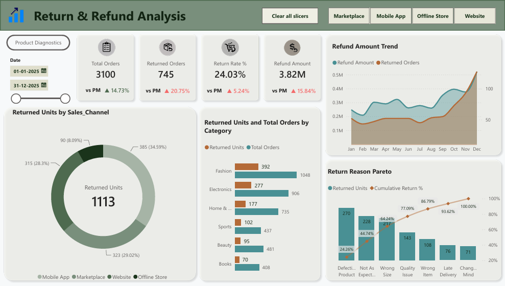
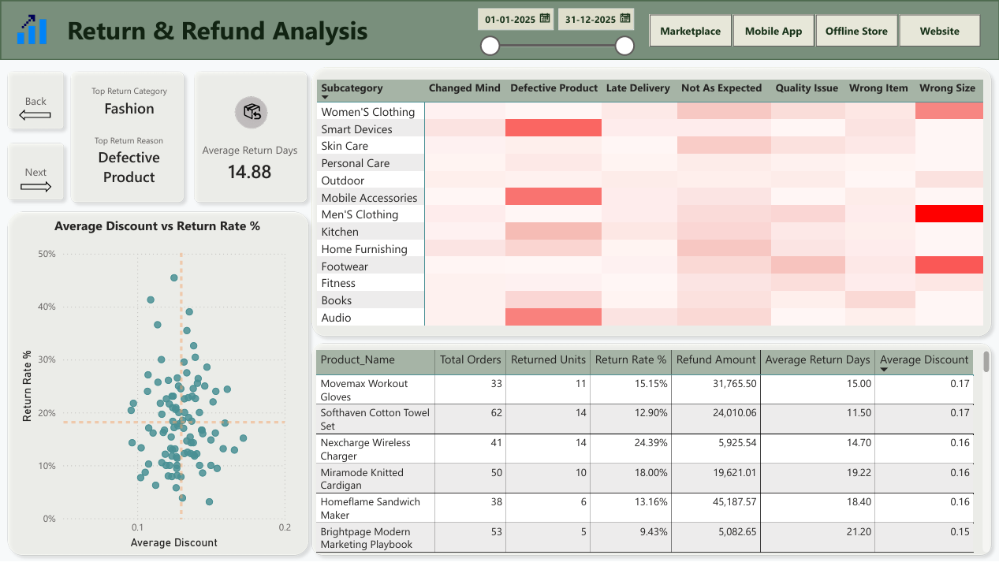
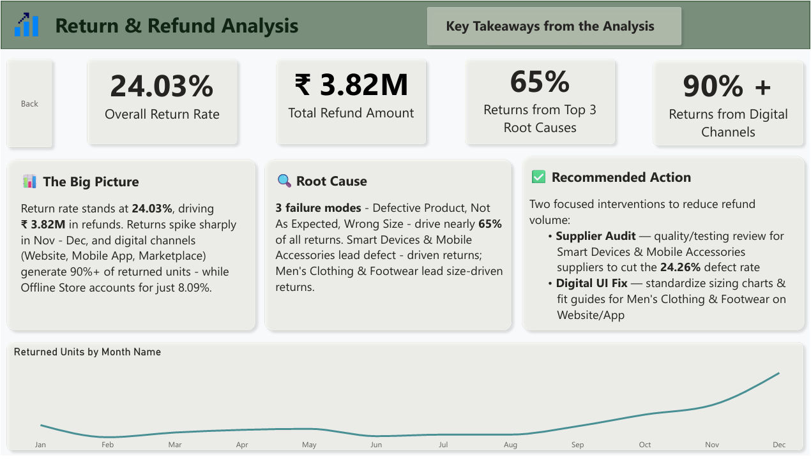

# ecommerce-returns-dashboard
Power BI dashboard uncovering why 24% of e-commerce orders get returned, costing ₹3.82M in refunds. Includes Pareto root-cause analysis, category-level diagnostics, and actionable recommendations.
# Return & Refund Analysis Dashboard

An interactive Power BI dashboard analyzing product return patterns across an e-commerce business, identifying root causes of returns and quantifying their financial impact to support quality control and UX decisions.

## Overview

This project analyzes return and refund data (Jan–Dec 2025) to answer three core business questions:

1. **How big is the return problem, and where is it concentrated?**
2. **What is actually causing returns — product quality, sizing, expectations, or price?**
3. **What specific, actionable interventions would reduce refund volume?**

## Key Findings

- **Overall return rate: 24.03%**, driving **₹3.82M** in total refunds — up 15.84% vs. the previous period
- **Digital channels dominate returns**: Website, Mobile App, and Marketplace together account for **90%+** of returned units, while the Offline Store accounts for just **8.09%**
- **Returns are highly concentrated by cause**: Pareto analysis shows just 3 failure modes — *Defective Product, Not As Expected,* and *Wrong Size* — account for nearly **65%** of all returns
- **Root causes are category-specific**:
  - *Smart Devices* and *Mobile Accessories* drive the majority of defect-related returns (24.26% defect rate)
  - *Men's Clothing* and *Footwear* drive sizing-related returns disproportionately
- **Discount level is not a meaningful driver of returns** — scatter analysis of average discount vs. return rate shows no strong correlation, ruling out pricing as a root cause
- Returns show **strong seasonality**, spiking sharply in November–December

## Recommendations

Based on the root-cause analysis, two focused interventions are proposed:

- **Supplier Quality Audit** — Initiate a hardware quality/testing audit for the primary suppliers of Smart Devices and Mobile Accessories to reduce the 24.26% defect rate
- **Digital UI Update** — Standardize sizing charts, fit guides, and product descriptions for Men's Clothing and Footwear across the Website and Mobile App to reduce expectation and sizing mismatches

## Dashboard Pages

| Page | Description |
|---|---|
| **Executive Summary** | High-level KPIs (orders, returns, return rate, refund amount), returns by sales channel, returns by category, refund trend over time, and return-reason Pareto |
| **Product Diagnostics** | Subcategory-level return reason heatmap, average discount vs. return rate scatter analysis, and product-level return rate table |
| **Key Takeaways** | Summary of findings and recommended actions |

## Tools & Techniques

- **Power BI Desktop** — report design and data modeling
- **Power Query** — data cleaning and transformation
- **DAX** — calculated measures (Return Rate %, Refund Amount, Cumulative Return %, period-over-period comparisons)
- **Data visualization** — Pareto charts, trend analysis, heatmaps, scatter plots

## How to View

- Open `Return-Refund-Analysis.pbix` in [Power BI Desktop](https://www.microsoft.com/en-us/power-platform/products/power-bi/downloads) to interact with filters, slicers, and drill-throughs
- Or view the static screenshots in the `/screenshots` folder for a quick look

